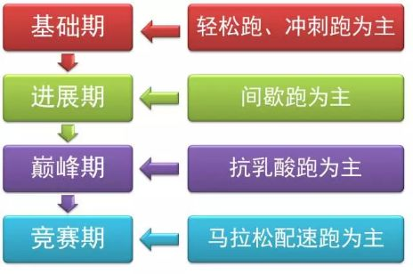
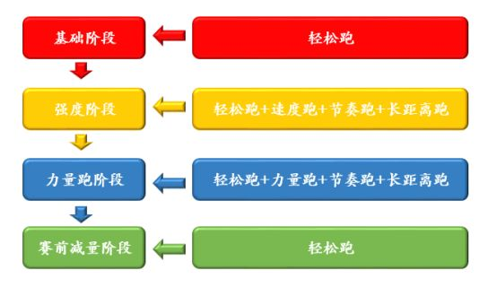
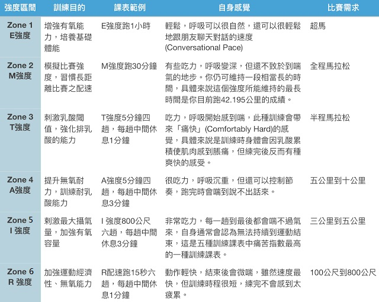

# Marathon

## 比赛装备

- 穿戴
  - 鞋 + 袜 + 压缩裤 + 背心
  - 臂袖 + 导汗带 + 手套
  - 表(满电) + 耳机 + 纸巾
- 补给:
  - 酸轻片
  - 盐丸
  - 能量胶
  - 口服液
  - 小瓶水
- 寄存: 小背包 + 皮肤衣 + 拖鞋 + 充电器

## 训练理论

- 丹尼尔斯: 训练周期18—24周，通常状况下分为四个阶段周期：基础期、进展期、巅峰期、竞赛期!
  - E跑（轻松跑
  - M跑（马拉松配速跑）
  - T跑（乳酸门槛跑）
  - I跑（间歇跑）
  - R跑（冲刺跑）
- 汉森: 训练周期18周，分为四个阶段：基础阶段、强度阶段、力量跑阶段、赛前减量阶段!
  - 轻松跑
  - 长距离跑
  - 速度跑(间歇跑)
  - 节奏跑(M配速)
  - 力量跑(乳酸阈)
- 徐国锋(RQ) 可以依跑者過去的訓練狀況來評估他的六級訓練配速區間!
- Juching (71 -> 78km)
  - 1 [场][12km] => E -> M -> T 12km (R 20s * 5)??
  - 2 [场][6km] => E 3km + I + E 3km
    - [8km] (I 400 + E 400) * 10
    - [8km] (I 600 + E 400) * 8
    - [7.2km] (I 800 + E 400) * 6
    - [7km] (I 1000 + E 400) * 5
    - [6.4km] (I 1200 + E 400) * 4
    - [6km] (I 1600 + E 400) * 3
    - [9.2km] (I 400/800/1200/1600/1200/800/400) + E 400
    - [7.2km] (I 800 + E 400) * 6
    - [8km] (I 1600 + E 400) * 4
    - [12km] (I 1600 + E 400) * 6
    - [12.8km] (I 2400 + E 800) * 4
    - [12.6km] (I 3200 + E 1000) * 3
    - [12.4km] (I 5000 + E 1200) * 2
    - [12.6km] (I 3200 + E 1000) * 3
    - [12.8km] (I 2400 + E 800) * 4
    - [12km] (I 1600 + E 400) * 6
  - 3 [路][15km] => E 15km
  - 4 [场][12km] => E -> M 30min + 跑坡(I & R) * (10 -> 15) + E 2km
  - 5 [0km] => REST
  - 6 [0km] => 体能(健身/游泳/羽毛球)
  - 7 [路][22km] => M -> T 90min/Half

## 参考阶段一

> 半马 1:41:58 | 配速 4:50 | VDOT 44.1

---

 **赛程**  | **时间**  | **配速**
--------- | --------: | -------:
 **Full** |  3:31:52  |  5:01
 **Half** |  1:41:58  |  4:50
 **10Mi** |  1:16:25  |  4:45
 **15K**  |  1:10:53  |  4:44
 **10K**  |  46:02    |  4:36
 **8K**   |  36:22    |  4:33
 **6K**   |  26:53    |  4:29
 **5K**   |  22:12    |  4:26
 **2Mi**  |  13:55    |  4:19
 **3.2K** |  13:49    |  4:19
 **3K**   |  12:54    |  4:18
 **1Mi**  |  6:32     |  4:04
 **1.6K** |  6:29     |  4:03
 **1.5K** |  5:59     |  3:59

---

  **项目**  |   **1 Mi**   |   **1 Km**
---------- | -----------: | -----------:
 **轻松跑** |  9:06~10:01  |  5:39~6:13
 **马拉松** |  8:05        |  5:01
 **乳酸阈** |  7:35        |  4:43
 **间歇跑** |  6:59        |  4:20
 **重复跑** |  6:34        |  4:05

  **项目**  | **1200M** | **800M** | **600M**
---------- | --------: | -------: | ---------:
 **乳酸阈** |   5:39    |   3:46   |   2:50
 **间歇跑** |   5:12    |   3:28   |   2:36
 **重复跑** |   4:54    |   3:16   |   2:27

  **项目**    | **400M** | **300M** | **200M**
------------- | -------:| -------: | ---------:
 **间歇跑**    |  1:44   |   1:18   |   0:52
 **重复跑**    |  1:38   |   1:14   |   0:49
 **快速重复**  |  1:30   |   1:08   |   0:45

## 参考阶段二

> 半马 1:33:11 | 配速 4:25 | VDOT 49.0

---

 **赛程**  | **时间**  | **配速**
--------- | --------: | -------:
 **Full** |  3:14:08  |  4:36
 **Half** |  1:33:11  |  4:25
 **10Mi** |  1:09:48  |  4:20
 **15K**  |  1:04:45  |  4:19
 **10K**  |  42:05    |  4:13
 **8K**   |  3:16     |  4:09
 **6K**   |  24:35    |  4:06
 **5K**   |  20:18    |  4:04
 **2Mi**  |  12:42    |  3:57
 **3.2K** |  12:37    |  3:57
 **3K**   |  11:46    |  3:55
 **1Mi**  |  5:57     |  3:42
 **1.6K** |  5:55     |  3:42
 **1.5K** |  5:26     |  3:38

---

  **项目**  |   **1 Mi**   |   **1 Km**
---------- | -----------: | -----------:
 **轻松跑** |  8:23~9:14   |  5:12~5:44
 **马拉松** |  7:24        |  4:36
 **乳酸阈** |  6:58        |  4:20
 **间歇跑** |  6:25        |  3:59
 **重复跑** |  6:00        |  3:44

  **项目**  | **1200M** | **800M** | **600M**
---------- | --------: | -------: | ---------:
 **乳酸阈** |   5:12    |   33:28  |   2:36
 **间歇跑** |   4:47    |   33:11  |   2:23
 **重复跑** |   4:29    |   32:59  |   2:14

  **项目**    | **400M** | **300M** | **200M**
------------- | -------:| -------: | ---------:
 **间歇跑**    |  1:36   |   1:12   |   0:48
 **重复跑**    |  1:30   |   1:07   |   0:45
 **快速重复**  |  1:22   |   1:01   |   0:41

## 参考阶段三

> 半马 1:27:54 | 配速 4:10 | VDOT 52.4

---

 **赛程**  | **时间**  | **配速**
--------- | --------: | -------:
 **Full** |  3:03:24  |  4:21
 **Half** |  1:27:54  |  4:10
 **10Mi** |  1:05:51  |  4:05
 **15K**  |  1:01:05  |  4:04
 **10K**  |  39:43    |  3:58
 **8K**   |  31:24    |  3:56
 **6K**   |  23:13    |  3:52
 **5K**   |  19:09    |  3:50
 **2Mi**  |  11:58    |  3:43
 **3.2K** |  11:53    |  3:43
 **3K**   |  11:05    |  3:42
 **1Mi**  |  5:36     |  3:29
 **1.6K** |  5:34     |  3:29
 **1.5K** |  5:07     |  3:25

---

  **项目**  |   **1 Mi**   |   **1 Km**
---------- | -----------: | -----------:
 **轻松跑** |  7:56~8:45   |  4:56~5:26
 **马拉松** |  7:00        |  4:21
 **乳酸阈** |  6:36        |  4:06
 **间歇跑** |  6:04        |  3:46
 **重复跑** |  5:40        |  3:31

  **项目**  | **1200M** | **800M** | **600M**
---------- | --------: | -------: | ---------:
 **乳酸阈** |   4:55    |   3:17   |   2:28
 **间歇跑** |   4:31    |   3:01   |   2:16
 **重复跑** |   4:13    |   2:49   |   2:07

  **项目**    | **400M** | **300M** | **200M**
------------- | -------:| -------: | ---------:
 **间歇跑**    |  1:30   |   1:08   |   0:45
 **重复跑**    |  1:24   |   1:03   |   0:42
 **快速重复**  |  1:16   |   0:57   |   0:38

## 各类训练的定义

### 轻松配速跑 [`E`]

- 范畴: 轻松配速跑通常是指训练前后的冷热身慢跑, 平日的恢复跑, 训练中的恢复跑以及通常的长距离跑。
- 强度: 一般在最大摄氧量 VO2max 的 59-74% 或最高心率 HRmax 的 65-79% 范围内。一般情况下, 轻松跑是一种舒适的可以跑中对话的配速跑, 每天可以有所不同, 这要取决于你当日身体状态, 以及你所处的天气和地形情况而定。你的实际配速相对于你的训练课表设定配速, 可以有高达每英里 +20 秒的不同。
- 目的: 轻松跑可以为进行更高强度的训练打下坚实的基础。生理上的益处是心脏肌肉得到加强, 心血管系统逐步完善, 使锻炼中的肌肉会得到更多的血液供应, 血液系统携带提供氧气的能力也会提升。
- 示例: 30-45 分钟 E。

### 马拉松配速跑 [`M`]

- 范畴: 匀速跑或长距离的重复跑
- 强度: 一般在最大摄氧量 VO2max 的 75-84% 或最高心率 HRmax 的 80-90% 的范围内。
- 目的: 对参加马拉松训练的跑者, 用来体验比赛速度; 对于新手, 可以用来替换训练课表上长跑日的轻松跑,
- 示例: 10 分钟 E, 60-90 分钟 M。

### 乳酸门槛配速跑 [`T`]

- 范畴: 稳定持续的节奏跑或周期性快速跑、也称为间歇巡航。
- 强度: 一般在最大摄氧量 VO2max 的 83-88% 或最高心率 HRmax 的 88-92% 的范围内。乳酸门槛配速跑是有一定舒适感觉的艰苦跑, 可以是一次匀速跑 3-4 英里(或 5 至 6 公里)亦或是几组 5~15 分钟的重复跑, 但其间要伴以 1~3 分钟的休息时间。
- 目的: 提高耐力
- 示例: 3x1 英里 T (1 分钟慢跑) 或 20 分钟 T。

### 最大摄氧量间歇配速跑 [`I`]

- 范畴: 最大摄氧量 VO2max 间歇跑
- 强度: 一般在最大摄氧量 VO2max 的 97-100% 或最高心率 HRmax 的 98-100% 的范围内, 间歇配速跑是"艰苦的"但绝对不是倾尽全力跑。间歇配速跑的速度接近于比赛速度, 总的间歇配速跑的时间应该在 10-12 分钟。为获得间歇配速跑训练的最好效果, 每组训练持续 3~5 分钟(800 米和 1000 米的训练是常采用的), 并在间歇跑之间用几乎相同的时间慢跑恢复(不一定用相同的时间, 慢跑相等的距离也可以)。如果训练课表上标明是 H(艰苦跑)那就要凭借身体状态, 按可以想象的偏保守的 5K 比赛速度作为间歇跑强度为宜。
- 目的: 强化有氧能力(最大摄氧量 VO2max)。在恰当的间歇跑强度下, 通常需要两分钟可以达到有效的最大摄氧量 VO2max, 因此单个“间歇跑”的理想时长为 3-5 分钟, 以确保期望的训练强度持续了恰当的时长。不超 5 分钟是防止过多的无氧运动导致血液乳酸浓度的增加而达不到预期的训练目的。
- 示例: 6x2 分钟 I(1 分钟慢跑), 5x3 分钟 I(2 分钟慢跑), 4x4 分钟 I(3 分钟慢跑)。

### 重复配速跑 [`R`]

- 范畴: 1500 米或 1 英里的比赛配速跑和轻松跑姿的快速跑
- 强度: 重复跑是快速的, 但不需要一定是"艰苦的", 因为训练比较短, 并且伴随有较长的恢复时间。由于重复跑的目的是为了提高跑步的速度能力和跑步的经济性, 因此恢复时间必须足够长, 以保证每次跑都没有感到比之前的更困难。如果你不以放松的跑姿进行重复跑, 那么你不会得到跑步速度能力的提高(同时也没能提高跑步的经济性)。如果进行 400 米重复跑, 那么其间的 3 分钟休息时长是必要的。减少重复跑之间的休息时间并不能产生更好的训练效果, 相反可能会得到一个糟糕的训练效果, 因为短暂休息会增加压力, 导致跑步经济性变差。重复跑的理想配速应该是你目前 1500m 或 1 英里的比赛配速为好。
- 目的: 提高跑步速度能力和跑步经济性
- 示例: 8x200 米 R(200 米慢跑)或 4x400 米 R(400 米慢跑)。

### 快速重复跑 [`F`]

- 范畴: 800 米比赛配速的重复跑
- 强度: 最好想象你在参加一个 800 米的比赛但是速度不应比你最近跑过的 800 米更快。在跑步速度可以监测的跑道上进行快速重复跑是最好的。在大多数的快速重复跑训练中, 一般有多组 200 米, 300 米或 400 米, 对精英运动员也许可以增加到 600 米。每组快速重复跑的时间不要超过 90 秒, 并保证在恢复时间内进行很容易的慢跑, 直到你感觉完全恢复。
- 目的: 为了提高跑步的速度能力, 增强无氧抗压能力, 并体会 800 米比赛的感觉
- 示例: 600 米 R(5 分钟慢跑), 2x400 米 F(4 分钟慢跑), 600 米 F(5 分钟慢跑), 2x300 米 F(3 分钟慢跑), 4x200 R(200 米慢跑)。

## 相关知识

> 感谢传奇教练杰克·丹尼尔斯(Dr.Jack Daniels)博士指导的超过 50 年的科学研究, 使得跑者和教练得以快速确定恰当的训练配速和相应的比赛能力, 以及如何应对温度和海拔的变化对训练和比赛的影响。

### 关于杰克·丹尼尔斯(Jack Daniels)

奥运选手, 世界著名教练, 运动科学家, 作家杰克·丹尼尔斯(Jack Daniels)是现代五项运动的两次奥运奖牌获得者, 也是举世闻名的运动科学家。他被《跑步世界》评为“世界最佳跑步教练", 他带领科特兰大学(Cortland University)的跑者参加了八届NCAA Division 全国冠军赛, 31 人入选国家队并获得 130 多个全美大奖。他指导的七名运动员参加了美国奥林匹克队, 并为数十名奥运会选手和奖牌获得者提供了建议。他因撰写《丹尼尔斯的跑步公式》而闻名世界, 该书最初于 1998 年发布, 概述了他的研究和独特的训练方法。

### 什么是VDOT(跑力值)?

VDOT(跑力值)是评价你的当前跑步能力的一个指标。
在广泛地研究和测定了各种速度和各种距离下众多跑者(耗时数十年)的最大摄氧量 VO2max 和次最大摄氧量 VO2sub-max(跑步经济性)之后, 可以明显地看到, 相同比赛用时的跑者常常没有相等甚至接近相等的最大摄氧量 VO2max, 而且愈加清晰的是, 跑步经济性与最大摄氧量 VO2max 对跑步能力的评估同样重要。
依据某种比赛的平均比赛速度计算出的氧气消耗量 VO2(以 1 分钟作为单位时间来计算氧气消耗)除以该比赛中最大摄氧量 VO2max 出现的百分比, 然后计算出“改良的最大摄氧量 pseudoVO2max", 称为 VDOT(跑力值)。通常氧气消耗量 VO2 中的体积 V上有一个点(表示 1 分钟的用量), 因此将此法计算的最大摄氧量 VO2max 称为 VDOT。
VDOT(跑力值)和所有耐力比赛的用时(从 800 米到马拉松)有关, 这显然是一种评价跑力效能的理想指标, 不论是不同的跑者还是不同的赛事。

----------------------------------------------

## 训练计划

> 轻松配速跑 [`E`]  
> 马拉松配速跑 [`M`]  
> 乳酸门槛配速跑 [`T`]  
> 最大摄氧量间歇配速跑 [`I`]  
> 重复配速跑 [`R`]  
> 快速重复跑 [`F`]  
> 休息 [`X`]  

### 全马 300

 **WEEK** | **DAY** |  **CONTENT**
 :------: | ------- | ----------------------------------------
 **[1]**  |   Mon   |   `X`
   .      |   Tue   |   `E`40-50min+`F`*5 (提升心肺)
   .      |   Wed   |   `I`P400 D1KM*5
   .      |   Thu   |   `E`30min
   .      |   Fri   |   `X`
   .      |   Sat   |   `E`30min+`F`*5
   .      |   Sun   |   渐进加速跑 20KM
 **[2]**  |   Mon   |   `X`
   .      |   Tue   |   `E`40-50min+`F`*5 (提升心肺)
   .      |   Wed   |   `M`P415 D10KM
   .      |   Thu   |   `E`30min
   .      |   Fri   |   `X`
   .      |   Sat   |   `E`30min+`F`*5
   .      |   Sun   |   `M`P415 D20KM
 **[3]**  |   Mon   |   `X`
   .      |   Tue   |   `E`50-60min+`F`*5 (提升心肺)
   .      |   Wed   |   渐进加速跑 8-10KM
   .      |   Thu   |   `E`30min
   .      |   Fri   |   `X`
   .      |   Sat   |   `E`30min+`F`*5
   .      |   Sun   |   渐进加速跑 20KM (较第一周提速)
 **[4]**  |   Mon   |   `X`
   .      |   Tue   |   `E`50-60min+`F`*5 (提升心肺)
   .      |   Wed   |   `I`P400 D1KM*5
   .      |   Thu   |   `E`30min
   .      |   Fri   |   `X`
   .      |   Sat   |   `E`30min+`F`*5
   .      |   Sun   |   渐进加速跑 20KM (较第三周提速)
 **[5]**  |   Mon   |   `X`
   .      |   Tue   |   `E`50-60min+`F`*5 (提升心肺)
   .      |   Wed   |   越野 10KM (在起伏路面中更好的把握速度)
   .      |   Thu   |   `E`30min
   .      |   Fri   |   `X`
   .      |   Sat   |   `E`30min+`F`*5
   .      |   Sun   |   越野 20KM
 **[6]**  |   Mon   |   `X`
   .      |   Tue   |   `E`50-60min+`F`*5 (提升心肺)
   .      |   Wed   |   `I`P400 D1KM*6
   .      |   Thu   |   `E`30min
   .      |   Fri   |   `X`
   .      |   Sat   |   `E`30min+`F`*5
   .      |   Sun   |   渐进加速跑 20KM
 **[7]**  |   Mon   |   `X`
   .      |   Tue   |   `E`50-60min+`F`*5 (提升心肺)
   .      |   Wed   |   `I`P400 D2KM*5
   .      |   Thu   |   `E`30min
   .      |   Fri   |   `X`
   .      |   Sat   |   `E`30min+`F`*5
   .      |   Sun   |   渐进加速跑 20KM (较第六周提速)
 **[8]**  |   Mon   |   `X`
   .      |   Tue   |   `E`50-60min+`F`*5 (提升心肺)
   .      |   Wed   |   `I`P345 D400m*12
   .      |   Thu   |   `E`30min
   .      |   Fri   |   `X`
   .      |   Sat   |   `E`30min+`F`*5
   .      |   Sun   |   渐进加速跑 20KM (P430-400)
 **[9]**  |   Mon   |   `X`
   .      |   Tue   |   `M`(T51:00 P418)+`E`(T5:00)
   .      |   Wed   |   `E`(T58:00 P501)+[`F`(T00:21 P330)+`X`(T1:03)]*5+`E`(T5:00)
   .      |   Thu   |   `M`(T47:00 P418)+[`T`(T7:03 P404)+`X`(T1:24)]*2+`E`(T5:00)
   .      |   Fri   |   基础体能训练
   .      |   Sat   |   `E`(T1:52:00 P501)+`E`(T5:00)
   .      |   Sun   |   `M`(T1:11:00 P418)+[`T`(T8:43 P404)+`X`(T1:44)]*2+`E`(T5:00)
 **[10]** |   Mon   |   `X`
   .      |   Tue   |   `M`(T51:00 P418)+`E`(T5:00)
   .      |   Wed   |   `E`(T58:00 P501)+[`F`(T00:21 P330)+`X`(T1:03)]*5+`E`(T5:00)
   .      |   Thu   |   `M`(T47:00 P418)+[`T`(T7:03 P404)+`X`(T1:24)]*2+`E`(T5:00)
   .      |   Fri   |   基础体能训练
   .      |   Sat   |   `E`(T1:52:00 P501)+`E`(T5:00)
   .      |   Sun   |   `M`(T1:11:00 P418)+[`T`(T8:43 P404)+`X`(T1:44)]*2+`E`(T5:00)
 **[11]** |   Mon   |   `X`
   .      |   Tue   |   `M`(T54:00 P418)+`E`(T5:00)
   .      |   Wed   |   `E`(T1:08:00 P501)+[`F`(T00:24 P330)+`X`(T1:12)]*5+`E`(T5:00)
   .      |   Thu   |   `M`(T50:00 P418)+[`T`(T7:28 P404)+`X`(T1:29)]*2+`E`(T5:00)
   .      |   Fri   |   基础体能训练
   .      |   Sat   |   `E`(T2:00:00 P501)+`E`(T5:00)
   .      |   Sun   |   `M`(T1:16:00 P418)+[`T`(T9:08 P404)+`X`(T1:49)]*2+`E`(T5:00)
 **[12]** |   Mon   |   `X`
   .      |   Tue   |   `M`(T54:00 P418)+`E`(T5:00)
   .      |   Wed   |   [`I`(T3:48 P344)+`X`(T3:48)]*5+`E`(T5:00)
   .      |   Thu   |   `M`(T50:00 P418)+[`T`(T7:28 P404)+`X`(T1:29)]*2+`E`(T5:00)
   .      |   Fri   |   基础体能训练
   .      |   Sat   |   `E`(T2:00:00 P501)+`E`(T5:00)
   .      |   Sun   |   `M`(T1:16:00 P418)+[`T`(T9:08 P404)+`X`(T1:49)]*2+`E`(T5:00)
 **[13]** |   Mon   |   `X`
   .      |   Tue   |   `M`(T51:00 P418)+`E`(T5:00)
   .      |   Wed   |   基础体能训练
   .      |   Thu   |   `M`(T47:00 P418)+[`T`(T7:03 P404)+`X`(T1:24)]*2+`E`(T5:00)
   .      |   Fri   |   `M`(T47:00 P418)+`E`(T5:00)
   .      |   Sat   |   `X`
   .      |   Sun   |   [待定]
 **[14]** |   Mon   |   `X`
   .      |   Tue   |   `M`(T47:00 P418)+`E`(T5:00)
   .      |   Wed   |   基础体能训练
   .      |   Thu   |   `M`(T44:00 P418)+[`T`(T6:38 P404)+`X`(T1:19)]*2+`E`(T5:00)
   .      |   Fri   |   `M`(T47:00 P418)+`E`(T5:00)
   .      |   Sat   |   `X`
   .      |   Sun   |   [比赛日]
